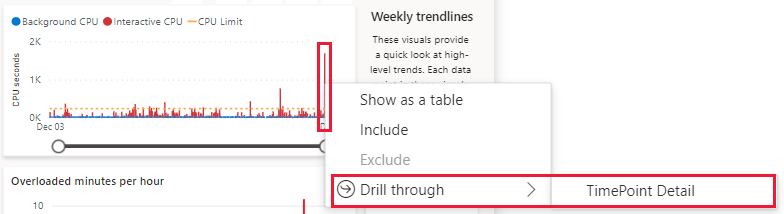
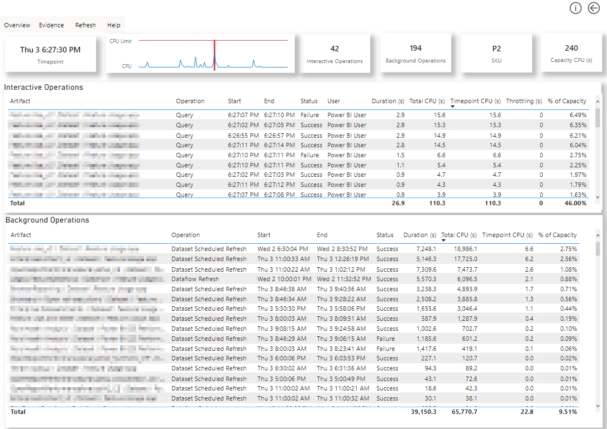

# Runbook

# Identify performance throttling and cpu overload
Use the Capacity metrics App to identify any over-usage of the CPU. Remember the ‘hidden’ drill through options for overloads
Pinpoint the objects and processes that use up the most CPU seconds on the tab.

User processes (report downloads, views, etc) and background processes ( dataset refreshes, dataflows, etc) will compete for cpu time.
If there are many sources of the overloads, check to see which ones are most resources hungry but note any object with over 20% utilization of the capacity

Datasets with several queries in quick succession from the same user during overloads suggest user quickly filtering or cross-highlighting in a report.

A longer-term monitoring solution like [Rui Romano's PBI monitor](https://github.com/RuiRomano/pbimonitor) is an example of hwo to get more insight about past performance. What activity types are being run during high load times and how are these different to low load timeframes?

Documentation link - [Monitor Power BI Premium Gen2 capacities with the Gen2 metrics app. - Power BI | Microsoft Learn](https://learn.microsoft.com/en-us/power-bi/enterprise/service-premium-metrics-app)

-----

# Engage with report owners
The next stage is specific to report/datset that you've identified. It's always best to open the report yourself or have a user describe the parts that are having issues

Things that stick out to an expereinced developer
- Pages with 20++ visuals
- Pages with large tables or matrix visualisations. (Bonus for having many measures added as well.)
- Many DAX calculated columns
- Complex DAX measures - 20+ lines
- DirectQuery tables
- Many to many relationships
- Tables without relationships
- Not using Star Schema modelling
-----

# Fixes
Having seen the performance reporting and the reports/datasets creating demand on the CPU of your capacity then you can implement techniques to reduce this load.

##  Capacity Techniques
Link below is the documentation for the settings in your capcity. These reduce impact of large queries on other users rather than fixing performance core issues.
The intermediate row limit concerns DirectQuery connections, total row limit for import connections

[Premium Capacity Settings](https://learn.microsoft.com/en-us/power-bi/enterprise/service-admin-premium-workloads?tabs=gen2#power-bi-settings)

## Report based techniques
An inspection of any overloading reports will give a great deal of insight into the issue. 
Does it contain a table visual with a high number of rows and or heavy DAX calculations?
Do report pages have 20+ visuals?
Remember that synced slicers create a copy of the slicer on every synced page.

Most of these techniques target query redcution and are useful when users quickly filter through slicers and cross filtering.

- If the report includes many clusters of visuals dedicated to KPIs- then try using custom visuals like the infographic designer or PureViz to create a single visual. This method reduces the number of queries sent to your datasources.
- Build separate pages and utilise drill-through to navigate between levels of your hierarchy 
(i.e. Business Unit, Project Portfolio, project details). 
Here is one of the many great videos for it - [link](https://youtu.be/4Qy-bksqExI).

- Turn on ‘apply’ buttons for filters and slicers. 
- The ‘apply all’ option for the filter pane will greatly reduce the number of queries sent
Great blog on Power BI query reduction - [Add an "Apply all filters" button to your report (datapears.com)](https://www.datapears.com/post/power-bi-query-reduction-add-an-apply-all-filters-button-to-your-report)
- Report default filters
    - Test report query string filters for user groups if they need subsets of data instead of full. [Filter a report using query string parameters in the URL - Power BI | Microsoft Learn](https://learn.microsoft.com/en-us/power-bi/collaborate-share/service-url-filters)
    - Test out user-level prefilters.
        - We would prioritise other steps before trying this option becuase it requires calculation groups which needs tabular editor or Dax Studio to configure.It is also hard to scale for multiple filters.
        - [Customizing default values for each user in Power BI reports - SQLBI](https://www.sqlbi.com/articles/customizing-default-values-for-each-user-in-power-bi-reports/)

## Model based techniques
- For relationships in DirectQuery or Dual mode turn on the option to ‘assume referential integrity’ – that will tell the PBI engine to use inner joins rather than outer joins on your data. Beware that it cannot be activated for tables where one is in import mode. It also assumes but not guarantee's integrity.

- Explore using a view or pre-built aggregations to help with large table visualisations and for very large models exceeding 50 million rows.

- Basic techniques for your dataset owner as well. to reduce the overall amount of data.

    - [Remove unnecessary columns](https://learn.microsoft.com/en-us/power-bi/guidance/import-modeling-data-reduction#remove-unnecessary-columns)

    - [Remove unnecessary rows](https://learn.microsoft.com/en-us/power-bi/guidance/import-modeling-data-reduction#remove-unnecessary-rows)
    - [Group by and summarize](https://learn.microsoft.com/en-us/power-bi/guidance/import-modeling-data-reduction#group-by-and-summarize)
    - [Optimize column data types](https://learn.microsoft.com/en-us/power-bi/guidance/import-modeling-data-reduction#group-by-and-summarize)
    - [Preference for custom columns in PQ over DAX](https://learn.microsoft.com/en-us/power-bi/guidance/import-modeling-data-reduction#group-by-and-summarize)
    - [Disable Power Query query load](https://learn.microsoft.com/en-us/power-bi/guidance/import-modeling-data-reduction#disable-power-query-query-load)
    - [Disable auto date/time](https://learn.microsoft.com/en-us/power-bi/guidance/import-modeling-data-reduction#disable-auto-datetime)
    - [Switch to Mixed mode](https://learn.microsoft.com/en-us/power-bi/guidance/import-modeling-data-reduction#disable-auto-datetime[[]])

- Ease dataset refresh strain on the capacity with the appropriate use of incremental refresh.

- If using DirectQuery – test enabling horizontal fusion via the preview features and for reports with many visuals on a single page
- Try turning the number of concurrent connections up past the default of 10 ( setting above 10 requires premium)

## Service techniques / Gateways
General Settings:
- Try auto aggregations with direct query sources.
- Limit scheduled refreshes to when needed. A good rule is that data source should be updated faster than people can make decisions with them. If near real time data is needed then use incremental refresh or hybrid tables.

If using a gateway for queries or refreshes then look at a couple of items.
- Test the latency of your datasource to the gateway then test your gateway's latency to the Azure region of your tenant. I find that 150ms latency starts adding too much to report.
    - [How to Use the Ping Command to Test Your Network](https://www.howtogeek.com/355664/how-to-use-ping-to-test-your-network/)
    - [Azure speed test 2.0](https://azurespeedtest.azurewebsites.net/)
- Consider the setup of your gateways and gateway clusters.
    - Do you have only one gateway on your cluster?
    - Do you have refresh traffice and query traffic on separate clusters? One requires more gateways on a cluster while the other requires more memory.
          
## Extended Monitoring options
Detailed Monitoring can be achieved for a single Power BI workspace by connecting it to a Log Analytics Workspace in Azure. This will show high levels of detail of queries sent to the dataset.

-----